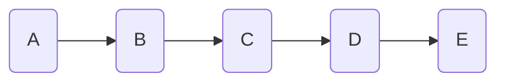
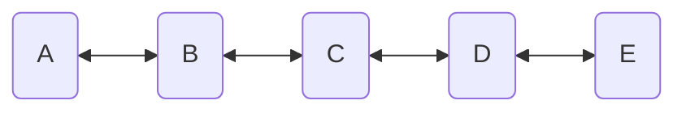
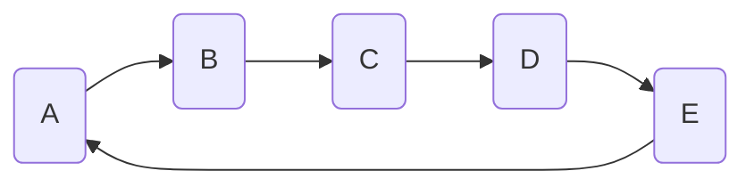
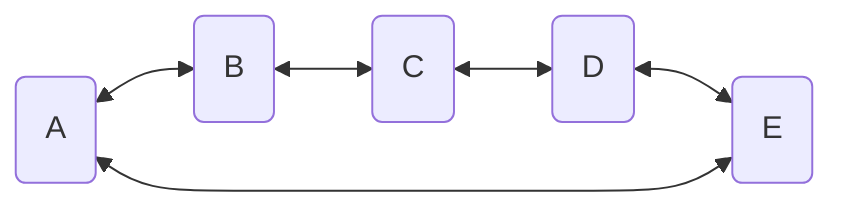
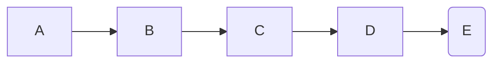
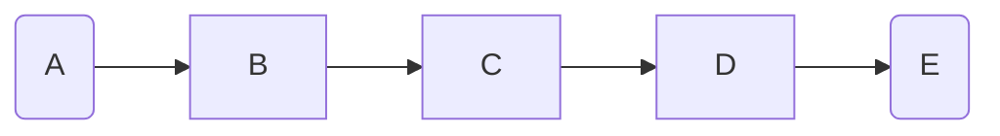

# CMP-201-01
### Friday, Feburary 23 - Class 16

- Insertion and deletion in the linked list
- List vs. doubly linked list vs. circular list
- Choice of data structure depends on how you'll be writing and accessing data
- The three C's of Computer Science (starting from 0):
    - Computer (The bare metal itself CMP-330)
    - Complexity (O(n) notation CMP-310)
    - Computability (Is it possible to compute this? CMP-320)
    - Craft (how does this apply to us? CMP-340)
- Konrad Zuse and the Z-series computers
- John von Neumann
- **Complexity**
    - The search problem: find a key in a list
        ```c++
        for (int i = 0; i < N; i++) {
            if(data[i] == key) {
                found = true;
            }
        }
        ```
    - Think about the best case: first element, and the worst case: last element
    - It's good to calculate the worst case
    - If we double the # of items in the list, what happens to the average runtime?
    - If it doubles, we call this search linear time complexity, O(n). We care how this scales
    - Sometimes we care about time correctness: speed at the expense of accuracy

#### Linked Data Structures
**List:**
Pointers to the next item



**Doubly Linked List:**
Pointers to next and previous item



**Circular List:**
The last item points to the first



**Doubly Linked Circular List:**
Pointers go both ways



**Stack:**
Can only push or pop at the end: **F**$_{\text{irst}}$**I**$_{\text{n}}$**L**$_\text{last}$**O**$_{\text{out}}$



**Queue:**
Add push at the end, and pop from the front: **F**$_{\text{irst}}$**I**$_{\text{n}}$**F**$_\text{irst}$**O**$_{\text{ut}}$



**Priority Queue:**
Pushing is based on priority
