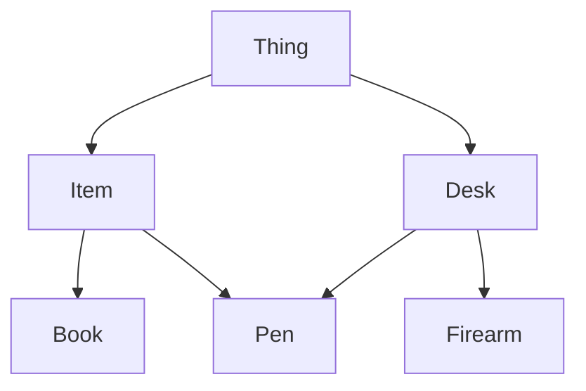

# CMP-201-01
### Friday, March 8 - Class 22

- When there are problems, abstract away one layer (pointers!!)
- Polymorphism: dynamic binding
- `virtual` and `override` keywords
- Multiple inheritance!

