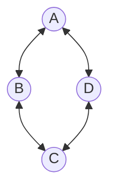
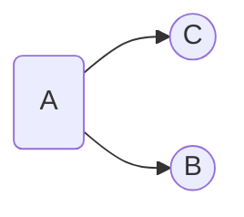
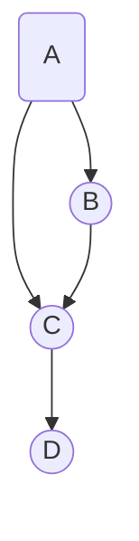
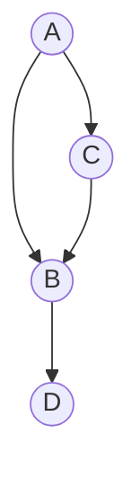

# CMP-201-01
### Wednesday, March 27 - Class 27

- Cybersecurity for civil air patrol, contact kpollock@hillsdale.edu to sign up
- **Graphs**:
- Nodes and edges

- Factorial complexity to search a graph space
- Directed graph

- Weighted graph

- Connected: There exists a path (a set of edges from one node to another) between any two nodes
- Not Connected: The path doesn’t exist
- Cycle: A path that starts and ends at the same node
- Dense: A lot of edges
- Spare: Not a lot of edges

- Adjacency Matrix:
- $n \times n$ matrix

|       | a   | b   | c   | d   |
| ----- | --- | --- | --- | --- |
| **a** | —   | 5   | 1   | —   |
| **b** | 5   | —   | 7   | 4   |
| **c** | 1   | 7   | —   | 2   |
| **d** | —   | 4   | 2   | —   |
- Adjacency List:
a —> b, 5 —> c, 1
b —> a, 5 —> c, 7 —> d, 4
e —> a, 1—> b, 7 —> d, 2
d —> b, 4 —> e, 2

- Tree: Connected, acyclic graph
- Forest: Collected subgraphs are all trees
