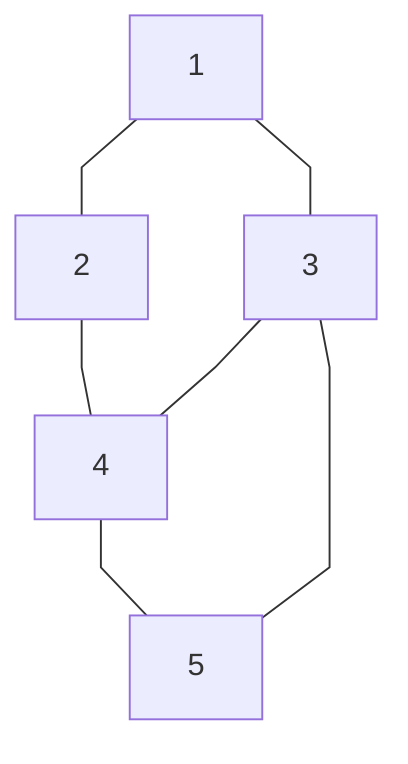

# CMP-201-01
### Friday, April 12 - Class 29

- Exam April 26th
- Languages: ALGOL, FORTRAN, APL, R, C, C++, Oak/Java
- More Huffman Code stuff
    - Step 1: 0.1(A, B), 0.15(E), 0.2(C), 0.2(D), 0.35(A)
    - Step 2: 0.2(C), 0.2(D), 0.25(B, E), 0.35(A)
    - Step 3: 0.25(B, E), 0.35(A), 0.40(C, D)
    - Step 4: 0.4(C, D), 0.6((B, E), A)
    - Step 5: 1.0((C, D), ((B, E), A)) [A: 11, B: 100, C: 00, D: 01, E: 101]
- Expression Tree: $a+b\cdot c + (d\cdot e + f) \cdot g$ gets made into a tree starting with (+(+(a, *(b, c)), *(g, +(*(d, e), f))))
- Minimum Spanning Tree:

